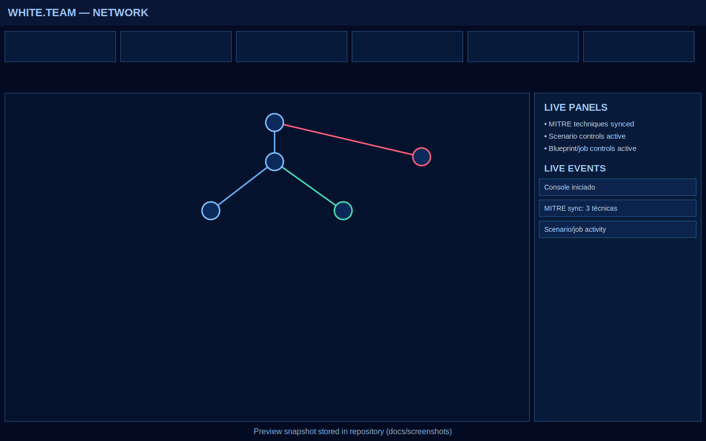

# Orion Range

**Orion Range** is an open-source **Cyber Range Orchestration Platform** designed to create realistic adversarial cybersecurity environments for **Red Team vs Blue Team exercises**.

The platform allows security teams to design, deploy, and operate complex cyber training environments where **attacks and defenses occur in controlled and reproducible infrastructures**.

Orion Range enables **White Teams to orchestrate complete enterprise environments**, including vulnerable systems, corporate networks, defensive infrastructure, and simulated user ecosystems.

---

# Why Orion Range

Traditional security labs usually consist of isolated vulnerable machines.
Orion Range introduces a different concept: **enterprise-scale cyber range orchestration**.

Instead of isolated machines, the platform models:

- corporate networks
- internal services
- defensive infrastructure
- user endpoints
- wireless devices
- external systems

This allows realistic adversarial simulations between **Red Teams and Blue Teams**.

---

# Key Concepts

## White Team Orchestration

The **White Team** controls the entire exercise environment.
They can:

- design network topologies
- insert hosts and services
- add vulnerabilities
- define MITRE ATT&CK coverage
- configure defensive infrastructure
- integrate external assets
- define exercise policies
- deploy or reset environments

---

## Red Team Operations

The **Red Team performs manual offensive operations**.
Orion Range **does not automate attacks**.

Red Team participants access the environment through **VPN** and perform:

- exploitation
- lateral movement
- privilege escalation
- persistence
- data exfiltration simulation

---

## Blue Team Operations

The **Blue Team monitors and defends the environment**.
The platform allows deployment of defensive infrastructure including:

- SIEM
- EDR / XDR
- IDS / IPS
- network monitoring
- firewall telemetry
- endpoint logging

Blue Team analysts investigate events and respond to attacks in real time.

---

# Core Capabilities

## Scenario Builder

White Teams can create environments by defining:

- network topology
- hosts
- vulnerabilities
- credentials
- defensive infrastructure
- exercise policies
- MITRE ATT&CK techniques

---

## Scenario Template Library

Scenarios can be saved as reusable templates.
This allows:

- scenario cloning
- versioning
- scenario libraries
- rapid exercise creation

---

## Visual Topology Designer

Orion Range includes a **visual network topology builder** allowing administrators to design complex environments including:

- internal networks
- DMZ segments
- Wi-Fi networks
- segmented environments
- enterprise architectures

---

## Hybrid Cyber-Physical Environments

The platform supports **integration with external systems**.
Examples:

- IoT devices
- electronic prototypes
- OT equipment
- remote labs
- physical training hardware

These systems can appear as nodes in the scenario topology.

---

## Corporate Ecosystem Simulation

Orion Range can simulate realistic corporate environments including:

- workstations
- servers
- user endpoints
- mobile devices
- BYOD devices
- guest network devices

Examples include:

- smartphones connected to Wi-Fi
- personal laptops
- tablets
- unmanaged devices

---

## MITRE ATT&CK Integration

Scenarios can be mapped to MITRE ATT&CK techniques.
This enables exercises aligned with real-world adversary behavior including:

- Initial Access
- Execution
- Lateral Movement
- Credential Access
- Persistence
- Exfiltration

---

## AI-Assisted Scenario Generation (Future)

Future versions of Orion Range will support **AI-assisted scenario creation**.

Administrators will be able to generate environments using natural language prompts.
Example:

Create a corporate network with a DMZ web server vulnerable to RCE, an internal Active Directory environment, a database server, and a SIEM monitoring all endpoints.

The AI engine generates a scenario blueprint which can then be edited and deployed by the White Team.

---

# Architecture Philosophy

Orion Range follows three principles:

### Infrastructure as Code

All environments are defined using **lab blueprints**.

### Deterministic Environments

Every environment can be **recreated and reset consistently**.

### Operational Realism

The platform models **complete corporate ecosystems** rather than isolated machines.

---

# Development Status

Orion Range is currently under active development.
Planned features include:

- full scenario orchestration engine
- AI-assisted blueprint generation
- multi-tenant cyber range support
- advanced MITRE modeling
- enterprise integrations

---

# Intended Use

Orion Range is designed for:

- cybersecurity training
- Red Team exercises
- Blue Team training
- Purple Team simulations
- academic research
- cyber defense capability development



### Running tests

```bash
cd backend
pytest
```

### Docker Compose

```bash
docker compose -f deploy/docker-compose.yml up --build
```

Compose starts `orion-api` and `postgres` for development persistence.

---

## Contributing

We welcome community contributions.

Ways to contribute:

- Implement MITRE technique modules
- Improve blueprint validation
- Develop scenario templates
- Enhance orchestration features
- Improve documentation

Please read the CONTRIBUTING.md file before submitting pull requests.

---

## License

Orion Range Core is licensed under the Apache License 2.0.

Copyright (c) 2026 Kra2Sec.

Enterprise extensions and advanced orchestration modules are developed separately by Kra2Sec.

---

## Legal Notice

Orion Range is an independent open-source project developed by Kra2Sec.
It is not affiliated with any institutional cyber range platform.

---

## Maintained By

Kra2Sec  
https://kra2sec.com

Founder & Lead Maintainer: Ênio Krauss

---

## Vision

Our goal is to provide an open and extensible foundation for building structured cyber simulation environments — bridging the gap between isolated lab setups and full-scale operational cyber range platforms.

Orion Range aims to make advanced cyber training reproducible, scalable, and accessible.

---
